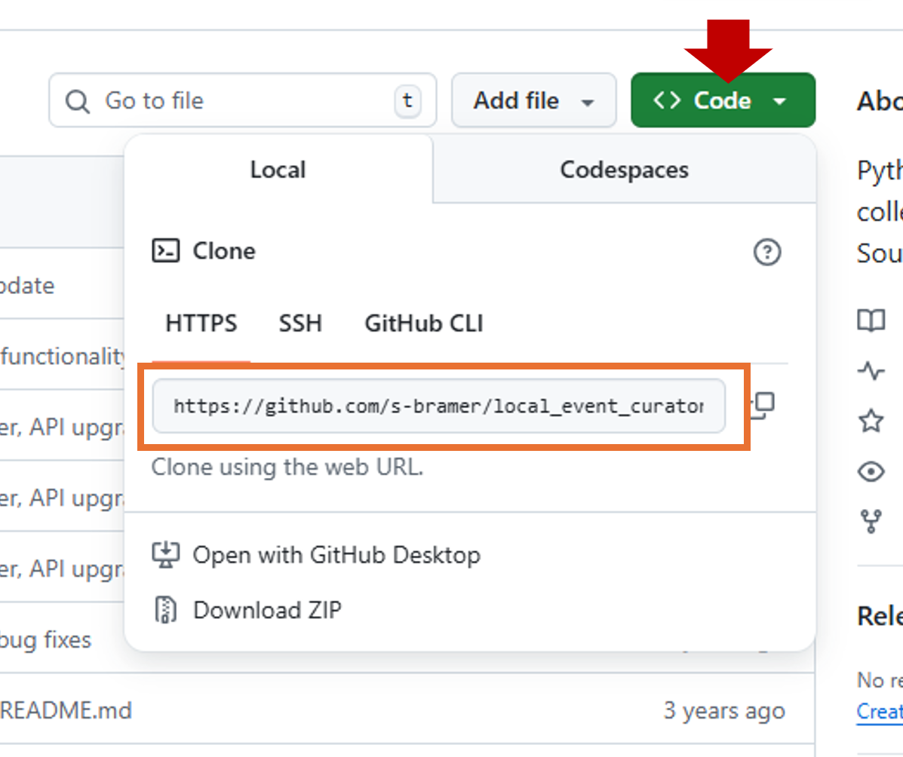

title: 4. Github
## Create Github project (remote repo)

-   On GitHub: *New → Repository*
-   Name: project-name
-   Initialise <span class="underline">without a README</span> if you already have local files, or with one if starting fresh.

## Initialise local repo and link to remote repo

First copy your remote repo link

{ width=400 }

In VSCode initialise local repo and connect to remote
```python
git init
git add .
git commit -m "Initial project structure"
git branch -M main
git remote add origin https://github.com/.. (your link)
git push -u origin main
```

