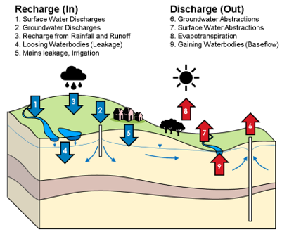

title: 5. Formatting & Layout Demo

This page shows common Markdown + MkDocs formatting options you can use.

---

## Headings, paragraphs, emphasis

Regular paragraph text goes here.  
You can use *italics*, **bold** and `inline code`  
This is ==important text== you want to highlight.

You can also combine them.

### Subheading

Another paragraph under a level-3 heading.

#### Level 4 heading

Short line of text.

---

## Lists

### Unordered list

- Bullet item one
- Bullet item two
    - Nested bullet
    - Another nested bullet
- Bullet item three

### Ordered list

1. First step
2. Second step
3. Third step

### Task list

- [ ] Open the model
- [x] Run baseline scenario
- [ ] Write up results

---

## Links and images

### Links

- Inline link: [MkDocs documentation](https://www.mkdocs.org/)
- Link to another page in the same site: [Run log](runs/index.md)

### Images

Below is an image reference. It will show if `img/model_schematic.png` exists in your `docs/img/` folder.



---

## Code blocks

```python
print("hello")
import xarray as xr 
ds = xr.open_dataset("data/processed/head_results.nc") 
print(ds.head.isel(time=0))
```

```bash
echo "hello"
```

```md
Use `foo()` to process values.
```

## Tabbed content

=== "TAB 1"

    ```bash
    # code in tab 1
    git commit -am "Message"
    git push
    ```

=== "TAB 2"

    1. List of items in tab 2
    2. Item
    3. ...
   
=== "TAB 3"

    - bullet points in tab 3
    - bullet 
    - ...

## Callouts

!!! tip "Tip"
    Tip Text

!!! note "Conda vs mamba"
    Prefer `mamba` for env creation; it’s much faster than `conda`.

[Other examples](https://mkdocs-magicspace.alnoda.org/tutorials/markdown/highlight-what-matters/)

## Collapsible sections

??? info "Show detailed steps"
    1. Do this  
    2. Then that  
    3. Finally commit & push

## Blockquotes

> This is a blockquote.  
> You can use it for short quotes or to visually separate important comments.

Nested blockquote:

> Outer quote
>
> > Inner quote

